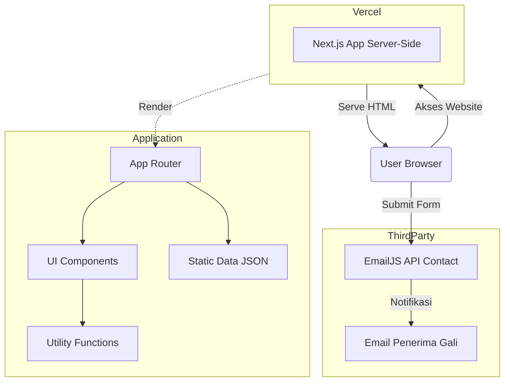
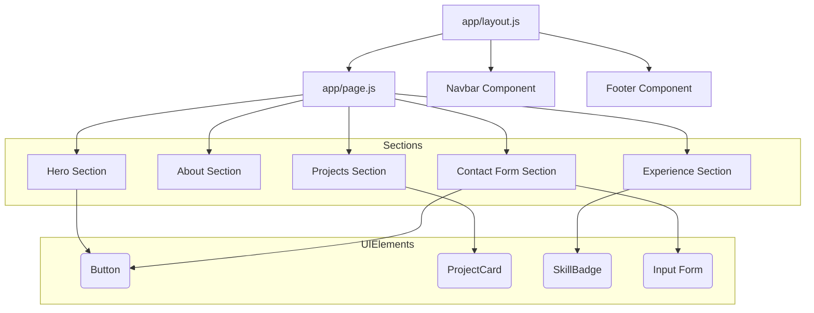
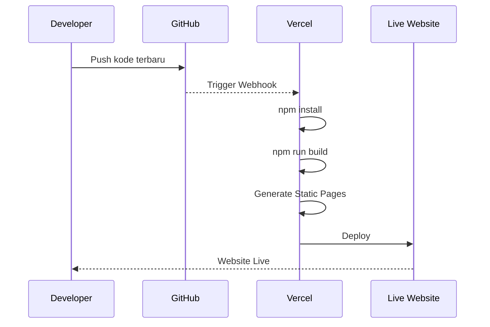

# Diagram Arsitektur Aplikasi - Portfolio Gali

Dokumen ini berisi visualisasi dari arsitektur aplikasi portofolio ini.

## 1. High-Level Architecture (Alur Sistem Keseluruhan)

---

## 2. Struktur Komponen (Component Hierarchy)

---

## 3. Alur Pengembangan & CI/CD (Deployment Flow)

